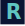

<p align="center">
  
</p>

<h2 align="center">Robin's Portfolio</h2>

<p align="center">
  Modern, straightforward, and minimalistic developer portfolio built with Next.js, Tailwind CSS, TypeScript, and React.
  <br />
  <em>Deployed on Vercel. Smooth scrolling powered by Lenis.</em>
</p>

## Quick Start

Requirements:

- Node.js ≥ 18.18
- A package manager: `pnpm`, `npm`, `yarn`, or `bun`

Clone and install:

```bash
git clone <https://github.com/theczechr/portfolio.git> portfolio
cd portfolio
pnpm install   # or your package manager of choice
```

Run locally:

```bash
pnpm dev
```

Build and start:

```bash
pnpm build
pnpm start
```

## Project Structure

```text
app/                 # App Router pages/layouts/components
  layout.tsx         # Root layout (metadata, fonts, providers)
  page.tsx           # Home page
  globals.css        # Global styles (Tailwind setup)
public/              # Static assets (images, icons, PDFs) and Hyprfolio (embedded project)
next.config.ts       # Next.js configuration
tsconfig.json        # TypeScript configuration
package.json         # Scripts and dependencies
```

## Forking

Although I've done my best to make it easy to fork and use, this is my personal portfolio, so I've embedded one of my projects, [Hyprfolio](https://github.com/theczechr/hyprfolio), under the `/hyprfolio` route, you might wanna remove it ;). If you wanted to use it, for whatever reason, it's included as a Git submodule, so you will need to initialize it after cloning (`git submodule update --init --recursive`).

Feel free to fork this repository and use it as a starting point for your own portfolio.

## License

This project is open source and available under the [MIT License](LICENSE).
